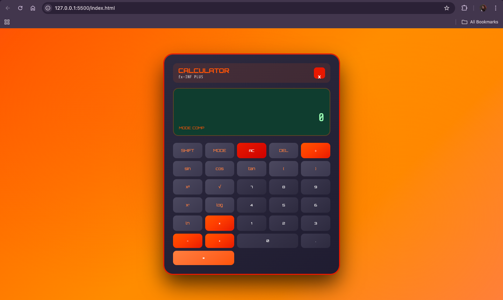

# 🔢 Calc-You-Later (Casio Style)

A modern and interactive **FX-991MS Plus inspired Scientific Calculator** built using **HTML, CSS, and JavaScript**.

This project replicates the look and feel of a real Casio scientific calculator with additional UI animations like an opening box effect and functional scientific operations.

---

## 🚀 Live Demo

You can view the calculator live here:

🔗 **Live Demo:** https://Ananya-Baghel.github.io/fx-991-calculator/


---

## 📸 Screenshots Preview

### 🔹 Opening Box Animation


---

### 🔹 Full Scientific Calculator Interface



---

### 🔹 SHIFT + MODE Working


---

## 🚀 Features

✅ Casio FX-991 Style User Interface  
✅ Smooth Box Open / Close Animation  

### ➕ Basic Arithmetic Operations
- Addition (+)  
- Subtraction (−)  
- Multiplication (×)  
- Division (÷)  
- Power (xʸ)

### 🔬 Scientific Functions
- sin, cos, tan  
- √ Square Root  
- x² Square  
- log and ln  

### 🔁 SHIFT Mode
- Enables inverse functions like:  
  - sin → sin⁻¹  
  - cos → cos⁻¹  
  - tan → tan⁻¹  
  - log → 10ˣ  
  - ln → eˣ  

### ⚙ MODE Button
- Toggle between DEG and RAD angle modes

### ⌨ Keyboard Support
- Use keys like `+ - * / Enter Backspace`

---

## 📂 Project Structure

```bash
calculator/
│
├── index.html
├── style.css
├── script.js
├── README.md
│
└── screenshots/
    ├── box-preview.png
    ├── calculator-ui.png
    └── shift-mode.png

```
🛠️ Technologies Used
---------------------

*   **HTML5** – Structure
    
*   **CSS3** – Styling, Grid Layout, Animations
    
*   **JavaScript (ES6)** – Calculator Logic and Scientific Functions
    

🎮 How to Run Locally
---------------------

1.  Clone the repository:
    
`   git clone https://github.com/Ananya-Baghel/fx-991-calculator.git   `

2.  Open the project folder:
    
`   cd fx-991-calculator   `

3.  Run the calculator:
    

Simply open index.html in your browser.

🌍 Deploy on GitHub Pages
-------------------------

1.  Push your project to GitHub
    
2.  Go to:
    
`   Settings → Pages   `

1.  Select:
    

*   Branch: main
    
*   Folder: /root
    

1.  Save → Your site will be live at:
    

   `https://Ananya-Baghel.github.io/fx-991-calculator/   `

📌 Future Improvements
----------------------

*   Full bracket expression solving
    
*   Memory buttons (MC, MR, M+)
    
*   Real Casio MODE menu
    
*   Dark/Light themes
    
*   Mobile App Version
    

👩‍💻 Author
------------

**Ananya Baghel**Aspiring AI/ML Engineer | Web Developer

⭐ Support
---------

If you like this project, don’t forget to:

🌟 Star the repository🍴 Fork it📢 Share it
